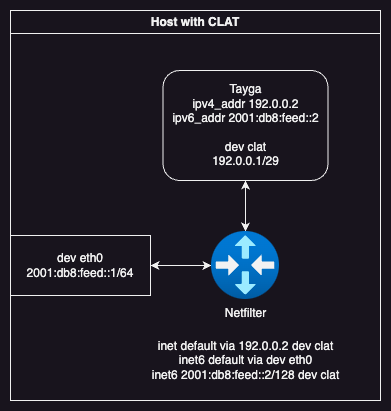

# Client-Side Translator (CLAT)

This example configures Tayga to perform stateless CLAT function, used in 464xlat. This provides IPv4 functionality to the local system, relying on the network to provide NAT64. 

None of these scripts are intended to be utilized as a best practice for actually running a CLAT. Details such as generating random SLAAC addresses, duplicate address discovery, etc. are skipped to demonstrate the function of the CLAT.

In all cases, we require two addresses - one is used along with Tayga's `map` directive to map IPv4 user traffic to IPv6, the other is used by Tayga as its own address as the source of ICMPv6 error messages. For simplicity, all examples use two addresses in a `/127` pair (i.e. two addresses which differ only by their last bit).

## 464XLAT Architecture
CLAT functionality may be seen as a specialized form of SIIT with exactly one mapping usable only by the local system. The translator (Tayga) performs address translation for exactly one IPv4 address, usually taken from the DSLite range (192.0.0.0/29) to exactly one IPv6 address. The local system is assigned an IP in the DSLite range, and uses this IP to communicate with Tayga and therefore the rest of the IPv4 internet. 464xlat is only designed to provide access to outgoing connections over IPv4, it is not designed for unsolicited incoming traffic, but traditional NAT traversal methods do work. Generally NAT64 devices can also be configured with explicit address mappings, allowing 464xlat to be used to carry unsolicited incoming traffic as well.

## Data Path
In this example, one interface is used:
* `eth0` represents the physical interface of the system, which is likely IPv6-only
* `clat` is the name of the tunnel interface created by Tayga

In this example, the following IP addresses are used internally:
* `64:ff9b::/96` is used as the NAT64 prefix `pref64`
* `2001:db8:feed::/64` is used as the LAN subnet on `eth0`
* `192.0.0.0/29` is used as the translation subnet for the local system, as it is reserved for IPv4 to IPv6 transition technologies 
* `192.0.0.1/29` is used as the IPv4 address of the local system
* `192.0.0.2/29` is used as the IPv4 address of Tayga itself
* The address of the IPv6-translated user traffic as well as IPv6 address of Tayga itself varies by implementation

The architecture for all methods is the same (this figure uses example addresses from Proxy NDP)

## Incoming Connections
The Proxy NDP or Dynamic Routing methods both allow incoming connections to IPv4-only software on the host, however, incoming connections must themselves be from IPv4-translated addresses, as Tayga has no way of translating the source address otherwise. 

# Proxy NDP
In this approach, a new address on the LAN subnet is generated for use by Tayga. To allow access to the LAN subnet by Tayga, this address is configured for NDP Proxying on the LAN interface, and routed to the Tayga translation interface. This scenario works well if the LAN addresses are assigned via SLAAC, allowing the host to generate additional address(es) for use by the translator. In this scenario, we generate two sequential address (within a /127 subnet), one for Tayga itself and one for user traffic. These addresses MUST be generated from your LAN subnet and MUST be unique, as they are used within your LAN network.

* `2001:db8:feed::6` is used as the IPv6 address of Tayga itself
* `2001:db8:feed::7` is used as the IPv6 address for translated user traffic

# NAT66 (Masquerade)
If the translator is unable to assign an additional address (for example, if the host is forced to use DHCPv6 IA_NA addressing), we can instead use NAT66 to masquerade traffic from the translator to the address already assigned to the host. In this scenario, the prefix `fd64::/64` is used for translation only and is not accessible outside of the local system, as packets on the network will appear from the hosts's LAN address (via NAT66).

* `fd64::/64` is used as the IPv6 range of the translator (masqueraded)
* `fd64::0` is (implicitly) used as the IPv6 address of the host on the translation network
* `fd64::1` is used as the IPv6 address of Tayga itself
* `fd64::2` is used as the IPv6 address for translated user traffic

# Dynamic Routing
If the host participates in dynamic routing, we can instead assign a routed address to the translator, and rely on the dynamic routing algorithm to route traffic. This approach can also be used where the host has requested a dedicated prefix using DHCPv6 IA_PD, for example, some container hosts may allocate a /64 to each host. The addresses in this case were chosen randomly, and may be any addresses within the prefix

* `2001:db8:abcd::/64` is the IPv6 prefix assumed to be routed to the host
* `2001:db8:abcd::64/127` is reserved for translation (any /127 may be used)
* `2001:db8:abcd::65` is used as the IPv6 address of Tayga itself
* `2001:db8:abcd::64` is used as the IPv6 address for translated user traffic
